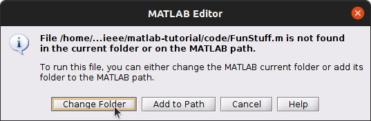

# Matlab Tutorial
A showcase of the most useful features of Matlab, for first-year university students

# 📈Look At This Graph!📉

1. Make a new *script* by clicking on the "New Script" button

2. Type these commands into the blank document:
```octave
t = linspace(0,4*pi,1000);
s = sin(t);
plot(t,s);
```
3. Press the big green **Run** button 
    * Name this new file and save it somewhere you won't forget 
    * Click on "Change Folder" if this window comes up 
4. Look at your cool graph!

Matlab lets you make mathematical graphs really easily.
Matlab also helps you do your homework! Let's see how...


# Balance a Chemical Reaction

# Launch a Projectile

# Write Your English Essay

# Write a Function
